# DOCUMENTO DE ARQUITECTURA DE SOFTWARE

Sistema de digitalización, procesamiento y consulta de registros históricos de trabajadores.

## 1. Introducción

La institución conserva información histórica de trabajadores en libros físicos. Estos documentos contienen registros laborales, periodos, años, referencias documentales y datos personales que deben mantenerse consultables, auditables y relacionados con su fuente original.

El problema actual es que la información se encuentra dispersa en soportes físicos, con consulta manual lenta, riesgo de deterioro, dificultad para validar datos y poca capacidad de trazabilidad entre un registro consultado y el libro, página o documento original que lo respalda.

El sistema propuesto digitaliza los libros, aplica OCR, extrae datos estructurados, los valida mediante un proceso ETL y los almacena en PostgreSQL. La consulta se realiza mediante una aplicación web con API REST, control de acceso, auditoría y referencias documentales almacenadas en Object Storage.

El propósito de esta arquitectura es definir una primera versión realista, mantenible y escalable, basada inicialmente en un monolito modular con procesamiento asíncrono. La arquitectura prioriza trazabilidad, seguridad de datos personales, control de calidad de importaciones y separación clara entre datos temporales, datos validados y documentos originales.

## 2. Objetivos

### Objetivo general

Diseñar una arquitectura de software para digitalizar, procesar, validar, almacenar y consultar registros históricos de trabajadores, garantizando trazabilidad completa desde el registro consultado hasta el libro físico y archivo digital de origen.

### Objetivos específicos

* Digitalizar libros físicos y conservar sus archivos originales en almacenamiento documental.
* Extraer información mediante OCR sin escribir directamente en tablas finales.
* Implementar un flujo de importación, validación y ETL con zona STAGING.
* Usar PostgreSQL como fuente principal de verdad.
* Proveer servicios REST seguros para consulta y administración.
* Permitir búsquedas por DNI, nombres, apellidos, año, periodo, libro y página.
* Auditar acciones críticas, correcciones, cargas e importaciones.
* Separar portal de consulta y portal administrativo según roles y permisos.
* Preparar una arquitectura que pueda crecer sin introducir microservicios prematuramente.

## 3. Alcance

### El sistema cubre

* Registro y control de libros, páginas y archivos digitalizados.
* Almacenamiento de PDF, TIFF, JPG, Excel, CSV, JSON y archivos procesados en Object Storage.
* Importación administrativa de Excel, CSV o JSON generados por OCR o por carga manual autorizada.
* Validación estructural y semántica de datos.
* Limpieza, normalización y deduplicación.
* Carga a tablas STAGING y posterior promoción a PRODUCCIÓN.
* Consulta web de trabajadores y registros históricos.
* Visualización y descarga controlada de documentos asociados.
* Auditoría de usuarios, importaciones, cambios y accesos relevantes.

### El sistema no cubre inicialmente

* Reemplazo de los procesos legales de custodia de documentos físicos.
* Eliminación de libros originales.
* Firma digital avanzada o expediente electrónico completo, salvo que se incorpore en una fase posterior.
* Automatización total de correcciones OCR sin revisión humana.
* Microservicios distribuidos como arquitectura inicial.
* Uso de Excel como base de datos operativa.

### Usuarios considerados

* Trabajadores.
* Operadores de digitalización.
* Administradores de datos.
* Personal de TI.
* Responsables institucionales.
* Auditores.

### Procesos considerados

* Digitalización.
* OCR y extracción.
* Carga administrativa.
* Validación y ETL.
* Corrección manual.
* Consulta.
* Auditoría.
* Respaldo y recuperación.

## 4. Stakeholders

| Stakeholder | Necesidad | Interés arquitectónico |
|---|---|---|
| Trabajadores | Consultar su historial laboral y documentos relacionados cuando estén autorizados. | Búsqueda rápida, privacidad, disponibilidad y claridad de resultados. |
| Administradores | Cargar, revisar, corregir y aprobar datos importados. | Portal administrativo, validaciones, trazabilidad y control de errores. |
| Operadores de digitalización | Registrar libros escaneados y asociar archivos a páginas o lotes. | Flujo simple de carga, metadatos documentales y control de calidad de imágenes. |
| Equipo TI | Operar, mantener, respaldar y monitorear el sistema. | Arquitectura simple, despliegue reproducible, logs, métricas y recuperación. |
| Responsables institucionales | Garantizar conservación, consulta y control de información histórica. | Seguridad, cumplimiento, auditoría y continuidad operativa. |
| Auditores | Verificar origen, cambios y consistencia de registros. | Auditoría inmutable, trazabilidad entre registro, libro, página y documento original. |

## 5. Requisitos arquitectónicos

### Requisitos funcionales

* Registrar libros físicos, años, páginas y archivos digitalizados.
* Cargar Excel, CSV y JSON desde el portal administrativo.
* Previsualizar datos antes de importarlos definitivamente.
* Validar estructura, campos obligatorios y formatos.
* Detectar errores, advertencias y duplicados.
* Permitir corrección manual controlada de datos importados.
* Ejecutar procesos ETL hacia STAGING y PRODUCCIÓN.
* Buscar trabajadores por DNI, nombres y apellidos.
* Consultar registros laborales por trabajador, año, periodo, libro y página.
* Relacionar cada registro laboral con su origen documental.
* Controlar acceso por roles y permisos.
* Registrar auditoría de cargas, cambios, accesos y aprobaciones.

### Requisitos no funcionales

| Atributo | Requisito |
|---|---|
| Rendimiento | Consultas comunes por DNI o trabajador deben responder en tiempos interactivos mediante índices y caché cuando corresponda. |
| Disponibilidad | El portal de consulta debe estar disponible durante horario institucional y preparado para recuperación ante fallos. |
| Seguridad | Todo acceso debe autenticarse y autorizarse; los datos personales deben protegerse con mínimo privilegio. |
| Escalabilidad | Los componentes de backend, workers, Redis y almacenamiento deben poder crecer de forma independiente. |
| Mantenibilidad | El backend debe organizarse como monolito modular con límites claros por dominio. |
| Trazabilidad | Todo registro productivo debe conservar vínculo a importación, libro, página y documento original. |
| Usabilidad | Los portales deben diferenciar tareas de consulta y administración con flujos simples. |
| Recuperación | Deben existir respaldos de PostgreSQL, Object Storage y configuración crítica. |
| Interoperabilidad | La API REST debe versionarse y usar formatos estándar JSON sobre HTTPS. |

## 6. Restricciones arquitectónicas

* La fuente histórica principal está en libros físicos.
* La calidad de escaneos puede variar por antigüedad, manchas, inclinación o deterioro.
* El OCR puede producir errores de caracteres, fechas, nombres y tablas.
* Excel, CSV y JSON son fuentes o formatos intermedios, no bases de datos.
* PostgreSQL se define como fuente principal de verdad.
* La infraestructura inicial debe poder operar con Docker Compose.
* Los archivos grandes no deben almacenarse como BLOB en PostgreSQL.
* La información contiene datos personales y requiere control de acceso.
* La revisión humana sigue siendo necesaria para registros dudosos.
* El sistema debe conservar evidencia del origen documental.

## 7. Vista de contexto - C4 Nivel 1

La vista de contexto muestra al sistema como una plataforma central que recibe documentos digitalizados, procesa importaciones y atiende consultas de usuarios autorizados. Los sistemas externos son el motor OCR, el almacenamiento documental y servicios institucionales opcionales de identidad o correo.

### Actores

* Trabajador.
* Administrador.
* Operador de digitalización.
* Auditor.
* Equipo TI.

### Sistemas externos

* Motor OCR.
* Object Storage compatible con S3 o MinIO.
* Servicio de identidad institucional, si existe.
* Servicio de correo para notificaciones, si se habilita.

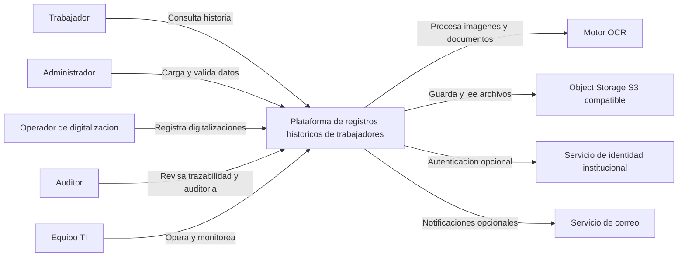

## 8. Vista de contenedores - C4 Nivel 2

La arquitectura usa contenedores lógicos separados, aunque el backend puede desplegarse inicialmente como una sola aplicación FastAPI modular. El procesamiento pesado se ejecuta en workers asíncronos para no bloquear consultas ni cargas administrativas.

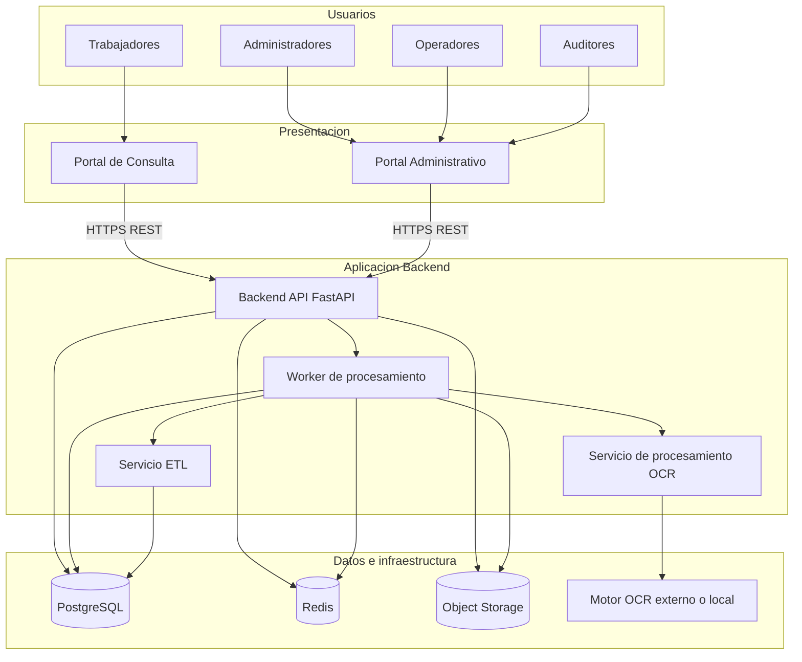

## 9. Vista de componentes - C4 Nivel 3

El backend se organiza como monolito modular. Cada módulo expone servicios internos y controladores REST, comparte infraestructura común y mantiene límites de responsabilidad claros.

| Componente | Responsabilidad |
|---|---|
| Authentication Service | Inicio de sesión, emisión y renovación de tokens, validación de credenciales. |
| Authorization Service | Evaluación de roles, permisos y acceso a documentos o acciones administrativas. |
| User Management Service | Gestión de usuarios, roles, estado de cuenta y asignación de permisos. |
| Worker Search Service | Búsqueda de trabajadores por DNI, nombres, apellidos y filtros. |
| Historical Records Service | Consulta de registros laborales y relación con periodos, libros y páginas. |
| Document Service | Gestión de metadatos documentales, URLs firmadas y permisos de visualización. |
| Import Service | Registro de cargas, archivos fuente, previsualización y estado de importaciones. |
| ETL Service | Transformación, limpieza, deduplicación y promoción de STAGING a PRODUCCIÓN. |
| Validation Service | Reglas de estructura, campos obligatorios, fechas, DNI, duplicados y consistencia. |
| OCR Processing Service | Registro de trabajos OCR, recepción de resultados y vínculo con archivos procesados. |
| Audit Service | Registro de acciones críticas, cambios, accesos y eventos de seguridad. |

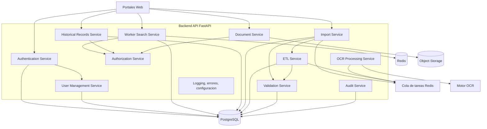

## 10. Arquitectura de datos

### STAGING versus PRODUCCIÓN

STAGING es la zona temporal y controlada donde llegan datos importados desde OCR, Excel, CSV o JSON. Allí se guardan datos crudos, datos normalizados parcialmente, errores, advertencias, duplicados y resultados de validación. Ninguna consulta oficial debe usar STAGING como fuente final.

PRODUCCIÓN contiene únicamente registros validados o aprobados. Es la fuente principal de verdad para consulta web, reportes, auditoría funcional y trazabilidad institucional.

### Modelo lógico propuesto

| Entidad | Descripción | Campos principales | Relaciones |
|---|---|---|---|
| trabajadores | Persona asociada a registros laborales históricos. | id, dni, nombres, apellido_paterno, apellido_materno, fecha_nacimiento opcional, estado, created_at, updated_at | Tiene muchos registros_laborales. |
| registros_laborales | Registro histórico consultable. | id, trabajador_id, periodo_id, libro_id, pagina_id, documento_id, anio, origen_registro, fecha_importacion, datos_normalizados | Pertenece a trabajador, periodo, libro, página y documento. |
| libros | Libro físico fuente. | id, codigo, titulo, anio_inicio, anio_fin, descripcion, estado_conservacion | Tiene muchas páginas y registros. |
| paginas | Página específica de un libro. | id, libro_id, numero_pagina, folio, documento_id, hash_imagen | Pertenece a libro y puede tener documento digital. |
| documentos | Metadatos de archivos en Object Storage. | id, tipo_documento, bucket, object_key, mime_type, checksum, size_bytes, version, created_at | Referenciado por páginas, importaciones y registros. |
| periodos | Periodos laborales o administrativos. | id, nombre, fecha_inicio, fecha_fin, anio | Referenciado por registros_laborales. |
| importaciones | Proceso de carga o procesamiento OCR. | id, tipo_fuente, estado, archivo_original_id, usuario_id, total_registros, total_errores, started_at, finished_at | Tiene staging rows, errores y auditoría. |
| staging_registros | Datos temporales importados. | id, importacion_id, row_number, raw_payload, normalized_payload, estado_validacion, fingerprint | Pertenece a importación. |
| errores_importacion | Errores y advertencias por importación o fila. | id, importacion_id, staging_registro_id, severidad, codigo, mensaje, campo | Pertenece a importación y opcionalmente a staging_registros. |
| usuarios | Usuario del sistema. | id, username, email, password_hash, activo, last_login_at | Tiene roles y auditoría. |
| roles | Rol funcional. | id, nombre, descripcion | Se asigna a usuarios. |
| permisos | Permisos granulares. | id, codigo, descripcion | Se asigna a roles. |
| auditoria | Registro de eventos críticos. | id, usuario_id, accion, entidad, entidad_id, before_data, after_data, ip, user_agent, created_at | Relacionada con usuarios y entidades auditadas. |

### Diagrama entidad-relación

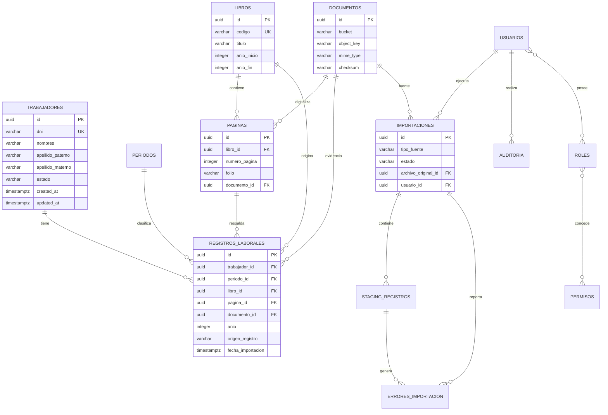

## 11. Flujo de digitalización

El flujo de digitalización separa captura documental, extracción OCR, validación y carga final. El OCR produce datos candidatos, no registros oficiales.

```mermaid
flowchart LR
    libro[Libro fisico]
    scan[Escaneo documental]
    files[PDF TIFF JPG]
    storage[Object Storage]
    ocr[Motor OCR]
    extract[Extraccion de texto tablas y campos]
    output[XLSX CSV JSON]
    validation[Validacion automatica]
    staging[(PostgreSQL STAGING)]
    review[Revision y correccion humana]
    prod[(PostgreSQL PRODUCCION)]

    libro --> scan
    scan --> files
    files --> storage
    files --> ocr
    ocr --> extract
    extract --> output
    output --> validation
    validation --> staging
    staging --> review
    review --> prod
    prod -->|mantiene referencias| storage
```

## 12. Flujo de importación de Excel

El flujo administrativo permite subir un archivo, previsualizar datos, validar, registrar errores y promover solo registros aprobados.

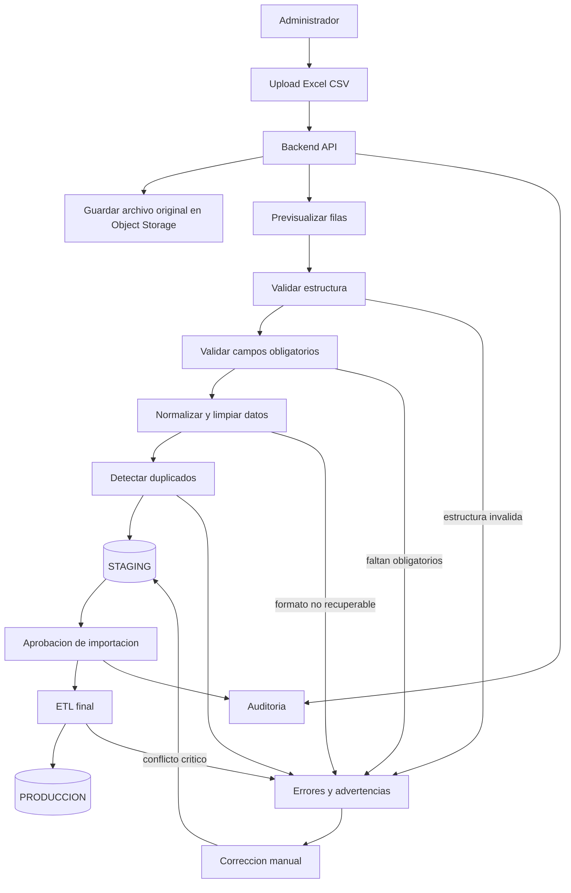

El flujo de error no descarta automáticamente la importación. Los errores se registran con severidad, fila, campo, valor original y regla fallida. Los registros con errores críticos no pasan a PRODUCCIÓN hasta ser corregidos o excluidos formalmente.

## 13. Flujo de consulta

Las consultas usan Redis como caché auxiliar. PostgreSQL sigue siendo la fuente de verdad. La caché puede almacenar resultados de búsquedas frecuentes, fichas de trabajador o historiales paginados con TTL corto y estrategia de invalidación ante cambios.

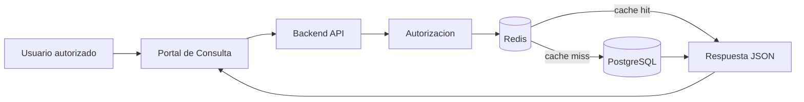

Cuando existe caché, la API valida permisos, recupera el resultado desde Redis y responde sin consultar PostgreSQL. Cuando no existe caché, la API consulta PostgreSQL usando índices, construye la respuesta, la guarda temporalmente en Redis si aplica y responde al usuario.

## 14. Diagrama de secuencia

Escenario: consultar historial de un trabajador.

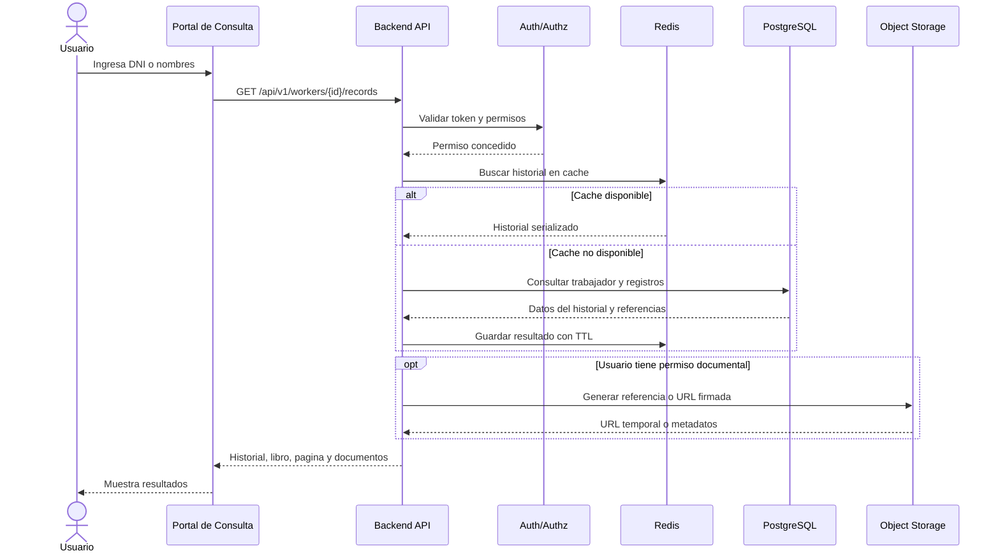

## 15. Arquitectura de despliegue

Para una primera versión productiva se recomienda Docker Compose sobre un servidor institucional o VM administrada. Kubernetes solo se justifica si existe crecimiento fuerte, múltiples nodos, alta disponibilidad formal o operación centralizada con experiencia previa.

### Componentes propuestos

* Nginx como reverse proxy y terminación TLS.
* Frontend de consulta y administración servido como aplicación web.
* Backend FastAPI con Gunicorn/Uvicorn.
* Worker asíncrono para OCR, ETL e importaciones.
* PostgreSQL con volumen persistente y backups.
* Redis para caché, rate limiting y cola de tareas.
* MinIO o S3 compatible para archivos.

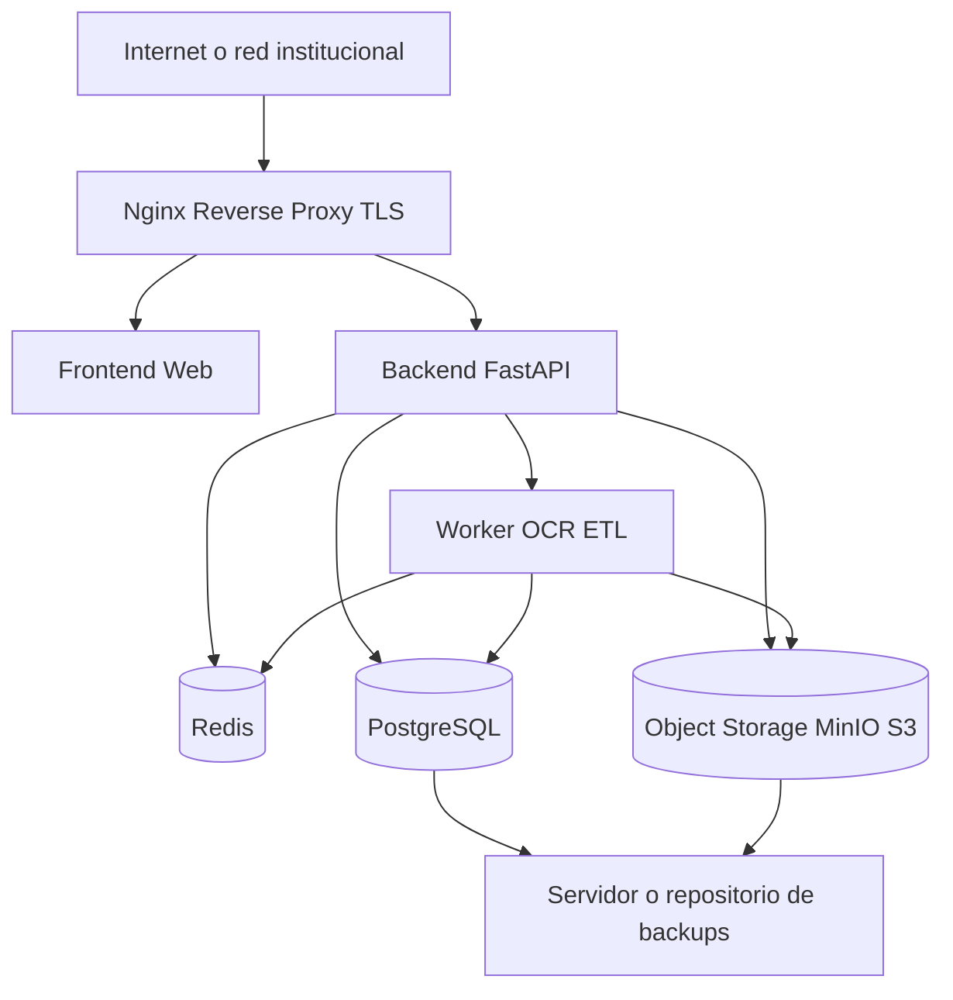

## 16. Seguridad

* HTTPS/TLS obligatorio en todo acceso web.
* Autenticación mediante JWT de corta duración y refresh token seguro, o integración con identidad institucional si existe.
* Autorización RBAC con permisos granulares para consulta, administración, documentos, importaciones y auditoría.
* Contraseñas con hash robusto, por ejemplo Argon2id o bcrypt con parámetros actualizados.
* Principio de mínimo privilegio en usuarios de aplicación, base de datos y Object Storage.
* Rate limiting por IP, usuario y endpoint sensible mediante Redis.
* Auditoría de inicios de sesión, cargas, correcciones, aprobaciones, descargas y accesos documentales.
* Validación estricta de uploads: extensión, MIME type, tamaño, checksum, antivirus si la institución lo requiere y bloqueo de contenido ejecutable.
* Protección frente a SQL Injection mediante ORM o consultas parametrizadas.
* Protección XSS mediante escape de salida, Content Security Policy y sanitización de campos mostrados.
* CSRF para formularios web si se usan cookies de sesión; si se usa Bearer token, revisar almacenamiento seguro del token.
* URLs firmadas y temporales para documentos protegidos.
* Backups cifrados cuando contengan datos personales.
* Separación de credenciales por ambiente.
* Registro de accesos fallidos y alertas ante comportamiento anómalo.

## 17. Rendimiento

Las consultas principales serán por DNI, nombres, apellidos, trabajador, año, periodo, libro y página. PostgreSQL debe resolver estas búsquedas mediante índices B-tree y, para búsquedas textuales por nombre, índices trigram con `pg_trgm` si se requiere tolerancia a errores.

Estrategias recomendadas:

* Índice único sobre `trabajadores.dni` cuando exista DNI válido.
* Índices compuestos en `registros_laborales(trabajador_id, anio)` y `registros_laborales(libro_id, pagina_id)`.
* Índices sobre `periodo_id`, `anio`, `fecha_importacion` y `origen_registro`.
* Paginación obligatoria en búsquedas y listados administrativos.
* Redis para consultas frecuentes y rate limiting.
* Workers asíncronos para OCR, validaciones masivas y promoción ETL.
* Procesamiento por lotes para importaciones grandes.
* Reportes descargables generados en segundo plano si superan umbrales de tiempo.

## 18. Escalabilidad

### Escalabilidad vertical

La primera estrategia consiste en aumentar CPU, memoria, disco y parámetros de PostgreSQL del servidor principal. Es apropiada para una primera etapa, reduce complejidad operativa y mantiene bajo el costo de mantenimiento.

### Escalabilidad horizontal

Cuando el volumen crezca, pueden escalarse independientemente:

* Frontend: múltiples réplicas detrás de Nginx o balanceador.
* Backend API: varias instancias stateless.
* Workers: más procesos para OCR e importaciones.
* Redis: instancia dedicada o modo administrado.
* PostgreSQL: réplica de lectura, tuning, particionamiento por año si el volumen lo exige.
* Object Storage: MinIO distribuido o S3 administrado.

La decisión discutible sería iniciar con microservicios. Para este dominio, la alternativa recomendada es monolito modular porque reduce complejidad y permite evolucionar módulos a servicios separados solo cuando exista presión real de escala u operación.

## 19. Disponibilidad y recuperación

* Backups diarios de PostgreSQL con retención definida por política institucional.
* Backups incrementales o snapshots para Object Storage.
* Pruebas periódicas de restauración, no solo generación de backups.
* Exportación de configuración crítica y variables no secretas.
* Monitoreo de espacio en disco, conexiones PostgreSQL, latencia y errores.
* Plan de recuperación con RPO y RTO definidos.
* Conservación de archivos originales digitalizados como evidencia primaria.
* Separación de backups de base de datos y documentos.
* Replica de lectura o standby de PostgreSQL si se requiere mayor disponibilidad.

## 20. Observabilidad

* Logs estructurados JSON en backend, workers y reverse proxy.
* Correlation ID por request e importación.
* Métricas de API: latencia, tasa de error, requests por endpoint.
* Métricas de PostgreSQL: conexiones, locks, consultas lentas, uso de índices.
* Métricas de Redis: memoria, hit rate, expiraciones, colas pendientes.
* Métricas de OCR: documentos procesados, tasa de error, tiempo promedio, confianza promedio.
* Métricas de importación: filas procesadas, errores críticos, advertencias, duplicados.
* Alertas ante fallos de backup, disco alto, cola detenida, errores 5xx y accesos sospechosos.
* Trazabilidad de operaciones administrativas mediante auditoría persistente.

## 21. Arquitectura de trazabilidad

La trazabilidad es un atributo central del sistema. Todo registro laboral en PRODUCCIÓN debe poder reconstruir su cadena de origen:

Trabajador -> registro histórico -> periodo -> libro -> página -> documento digital -> archivo original -> importación -> usuario o proceso que lo incorporó.

### Mecanismo propuesto

* `registros_laborales.trabajador_id` identifica al trabajador.
* `registros_laborales.libro_id` identifica el libro físico fuente.
* `registros_laborales.pagina_id` identifica la página o folio.
* `registros_laborales.documento_id` referencia el archivo digital principal del registro.
* `paginas.documento_id` referencia la imagen o PDF de la página.
* `documentos.bucket` y `documentos.object_key` ubican el archivo en Object Storage.
* `documentos.checksum` permite verificar integridad.
* `registros_laborales.importacion_id` o tabla puente equivalente permite conocer el lote de origen.
* `importaciones.archivo_original_id` conserva el Excel, CSV, JSON o paquete OCR original.
* `auditoria` registra cambios posteriores, usuario, fecha, valores previos y valores nuevos.

La regla arquitectónica es que una corrección administrativa no debe borrar el origen. Si un dato OCR se corrige, se conserva el valor anterior, el valor corregido, el usuario, la fecha y la razón de cambio. Esto permite explicar por qué un registro visible ya no coincide literalmente con el texto extraído inicialmente.

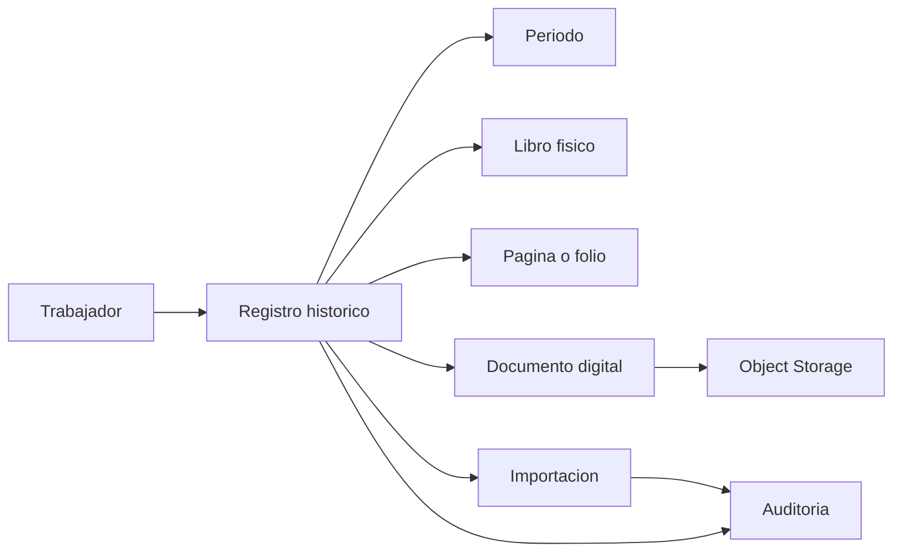

## 22. Decisiones arquitectónicas ADR

### ADR-001: Uso de PostgreSQL

* Estado: Aprobada.
* Contexto: El sistema requiere integridad relacional, consultas por múltiples criterios, auditoría y consistencia transaccional.
* Decisión: Usar PostgreSQL como base de datos principal y fuente de verdad.
* Alternativas evaluadas: MySQL, SQL Server, base documental, archivos Excel.
* Consecuencias: Se obtiene integridad, SQL maduro, índices avanzados y extensiones útiles.
* Ventajas: ACID, claves foráneas, JSONB cuando sea necesario, full text y trigram.
* Riesgos: Requiere administración, backups y tuning.

### ADR-002: Uso de zona STAGING

* Estado: Aprobada.
* Contexto: El OCR y los archivos importados pueden contener errores.
* Decisión: Todo dato importado pasa por STAGING antes de PRODUCCIÓN.
* Alternativas evaluadas: Carga directa a producción, validación solo en frontend.
* Consecuencias: Se agrega una etapa operativa, pero se reduce contaminación de datos finales.
* Ventajas: Control de calidad, corrección, trazabilidad y reprocesamiento.
* Riesgos: Mayor complejidad de estados y reglas de promoción.

### ADR-003: Uso de Object Storage

* Estado: Aprobada.
* Contexto: El sistema almacenará PDF, TIFF, JPG, Excel y archivos procesados.
* Decisión: Guardar archivos grandes en MinIO, S3 o almacenamiento compatible.
* Alternativas evaluadas: BLOB en PostgreSQL, filesystem local.
* Consecuencias: PostgreSQL almacena solo metadatos y referencias.
* Ventajas: Escalabilidad, checksums, versionado posible y mejor gestión de archivos.
* Riesgos: Requiere política de backup y control de permisos separado.

### ADR-004: Uso de Redis

* Estado: Aprobada con alcance auxiliar.
* Contexto: Se requiere caché, rate limiting y soporte a tareas asíncronas.
* Decisión: Usar Redis como infraestructura auxiliar, nunca como fuente principal de verdad.
* Alternativas evaluadas: Solo PostgreSQL, RabbitMQ para colas, caché en memoria local.
* Consecuencias: Aumenta una dependencia, pero reduce carga y mejora respuesta.
* Ventajas: TTL, contadores de rate limiting, colas simples y caché.
* Riesgos: Pérdida de datos temporales si no se configura persistencia cuando aplique.

### ADR-005: Uso de API REST

* Estado: Aprobada.
* Contexto: El frontend y posibles integraciones requieren comunicación estándar.
* Decisión: Exponer API REST versionada sobre HTTPS.
* Alternativas evaluadas: GraphQL, RPC interno, acceso directo a base de datos.
* Consecuencias: Se requiere diseño de endpoints, paginación, filtros y contratos.
* Ventajas: Simplicidad, interoperabilidad, madurez y facilidad de documentación OpenAPI.
* Riesgos: Puede crecer en número de endpoints si no se mantiene disciplina de diseño.

### ADR-006: Separación de procesamiento OCR y backend transaccional

* Estado: Aprobada.
* Contexto: El OCR es pesado, lento y puede fallar por calidad documental.
* Decisión: Ejecutar OCR mediante servicio o worker separado del flujo transaccional principal.
* Alternativas evaluadas: Ejecutar OCR dentro del request HTTP, carga manual sin OCR.
* Consecuencias: Las tareas OCR se gestionan con estados y cola.
* Ventajas: No bloquea usuarios, permite reintentos y aisla fallos.
* Riesgos: Requiere monitoreo de cola y gestión de trabajos pendientes.

### ADR-007: Uso de tareas asíncronas para procesos pesados

* Estado: Aprobada.
* Contexto: Importaciones, OCR y reportes pueden tardar más que un request HTTP razonable.
* Decisión: Procesar tareas pesadas en workers asíncronos.
* Alternativas evaluadas: Procesamiento sincrónico en API, jobs manuales por consola.
* Consecuencias: Se requieren estados, reintentos y seguimiento de progreso.
* Ventajas: Mejor experiencia de usuario y resiliencia operativa.
* Riesgos: Complejidad en idempotencia y manejo de reintentos.

### ADR-008: Uso de arquitectura modular

* Estado: Aprobada.
* Contexto: El sistema tendrá dominios de consulta, importación, documentos, seguridad y auditoría.
* Decisión: Implementar un monolito modular con límites internos claros.
* Alternativas evaluadas: Microservicios, aplicación monolítica sin módulos.
* Consecuencias: Menor complejidad inicial y mejor mantenibilidad.
* Ventajas: Despliegue simple, transacciones más fáciles y evolución gradual.
* Riesgos: Si no se respetan límites, puede degradarse a código acoplado.

## 23. Matriz de riesgos técnicos

| Riesgo | Probabilidad | Impacto | Mitigación |
|---|---:|---:|---|
| Errores OCR | Alta | Alta | Validación, revisión humana, umbrales de confianza y conservación de texto original. |
| Documentos ilegibles | Media | Alta | Control de calidad de escaneo, reescaneo y marcado de registros no recuperables. |
| Duplicados | Alta | Media | Fingerprints, reglas de coincidencia por DNI, nombre, año, libro y página. |
| Pérdida de archivos | Media | Alta | Object Storage con backups, checksums y monitoreo de integridad. |
| Corrupción de datos | Baja | Alta | Transacciones, constraints, backups y auditoría. |
| Importaciones incompletas | Media | Media | Estados de importación, reintentos idempotentes y conteos de control. |
| Lentitud en búsquedas | Media | Media | Índices, paginación, Redis y análisis de consultas lentas. |
| Accesos no autorizados | Media | Alta | RBAC, JWT, auditoría, rate limiting y mínimo privilegio. |
| Falla del servidor | Media | Alta | Backups, despliegue reproducible, monitoreo y plan de recuperación. |
| Pérdida de trazabilidad | Baja | Alta | FKs obligatorias, referencias documentales, auditoría y prohibición de borrado físico lógico crítico. |

## 24. Matriz de calidad

| Atributo | Objetivo | Estrategia arquitectónica | Métrica sugerida |
|---|---|---|---|
| Rendimiento | Consultas interactivas por DNI y trabajador. | Índices PostgreSQL, Redis, paginación. | p95 menor a 500 ms en consultas frecuentes. |
| Disponibilidad | Mantener servicio operativo en horario institucional. | Docker, monitoreo, backups, recuperación documentada. | Uptime mensual mayor a 99%. |
| Seguridad | Proteger datos personales y documentos. | HTTPS, RBAC, JWT, auditoría, validación de uploads. | 100% endpoints protegidos según matriz de permisos. |
| Escalabilidad | Permitir crecimiento por volumen documental. | Workers escalables, Object Storage, réplicas backend. | Procesar N documentos por hora según capacidad objetivo. |
| Mantenibilidad | Facilitar evolución del sistema. | Monolito modular, API versionada, ADR y pruebas. | Cobertura de módulos críticos y complejidad controlada. |
| Trazabilidad | Relacionar registro con fuente original. | FKs, documentos con checksum, importaciones y auditoría. | 100% registros productivos con libro, página e importación. |

## 25. API propuesta

| Método | Endpoint | Función | Roles permitidos |
|---|---|---|---|
| POST | `/api/v1/auth/login` | Autenticar usuario y emitir token. | Público autenticable |
| POST | `/api/v1/auth/refresh` | Renovar token. | Usuario autenticado |
| GET | `/api/v1/workers` | Listar o buscar trabajadores con filtros. | Administrador, Operador, Auditor |
| GET | `/api/v1/workers/{id}` | Obtener ficha de trabajador. | Trabajador propio, Administrador, Operador, Auditor |
| GET | `/api/v1/workers/{id}/records` | Consultar historial laboral. | Trabajador propio, Administrador, Operador, Auditor |
| GET | `/api/v1/search` | Búsqueda general por DNI, nombres, año o libro. | Administrador, Operador, Auditor |
| GET | `/api/v1/records/{id}` | Obtener detalle de registro histórico. | Usuario autorizado |
| GET | `/api/v1/documents/{id}` | Obtener metadatos o URL firmada de documento. | Usuario con permiso documental |
| POST | `/api/v1/imports` | Crear importación y subir archivo. | Administrador, Operador autorizado |
| GET | `/api/v1/imports` | Listar importaciones. | Administrador, Operador, Auditor |
| GET | `/api/v1/imports/{id}` | Consultar estado de importación. | Administrador, Operador, Auditor |
| GET | `/api/v1/imports/{id}/preview` | Previsualizar filas importadas. | Administrador, Operador |
| GET | `/api/v1/imports/{id}/errors` | Listar errores y advertencias. | Administrador, Operador, Auditor |
| POST | `/api/v1/imports/{id}/validate` | Ejecutar validación. | Administrador, Operador |
| POST | `/api/v1/imports/{id}/approve` | Aprobar promoción a producción. | Administrador |
| POST | `/api/v1/ocr/jobs` | Crear trabajo OCR. | Administrador, Operador |
| GET | `/api/v1/ocr/jobs/{id}` | Consultar estado OCR. | Administrador, Operador |
| GET | `/api/v1/audit` | Consultar auditoría. | Administrador, Auditor |
| GET | `/api/v1/users` | Gestionar usuarios. | Administrador |
| GET | `/api/v1/roles` | Consultar roles y permisos. | Administrador |

## 26. Estructura sugerida de PostgreSQL

### Tablas principales

| Tabla | PK | FK principales | Tipos importantes | Índices y restricciones |
|---|---|---|---|---|
| `trabajadores` | `id uuid` | - | `dni varchar(20)`, nombres, apellidos, timestamps | `UNIQUE(dni)` parcial si DNI no nulo; índice trigram en nombres completos. |
| `registros_laborales` | `id uuid` | trabajador, periodo, libro, pagina, documento, importacion | `anio int`, `origen_registro varchar`, `datos jsonb` | Índices por trabajador/año, libro/página, periodo y documento. |
| `libros` | `id uuid` | - | `codigo varchar`, años, estado | `UNIQUE(codigo)`, índice por rango de años. |
| `paginas` | `id uuid` | libro, documento | `numero_pagina int`, `folio varchar`, `checksum varchar` | `UNIQUE(libro_id, numero_pagina)`. |
| `documentos` | `id uuid` | - | `bucket`, `object_key`, `mime_type`, `checksum`, `size_bytes` | `UNIQUE(bucket, object_key)`, índice por checksum. |
| `periodos` | `id uuid` | - | `nombre`, `fecha_inicio`, `fecha_fin`, `anio` | Índice por año y fechas. |
| `importaciones` | `id uuid` | usuario, archivo_original | `estado`, `tipo_fuente`, contadores, timestamps | Índice por estado, fecha y usuario. |
| `staging_registros` | `id uuid` | importacion | `raw_payload jsonb`, `normalized_payload jsonb`, `fingerprint` | Índice por importación, estado y fingerprint. |
| `errores_importacion` | `id uuid` | importacion, staging_registro | `severidad`, `codigo`, `campo`, `mensaje` | Índice por importación y severidad. |
| `usuarios` | `id uuid` | - | `email`, `password_hash`, `activo` | `UNIQUE(email)`. |
| `roles` | `id uuid` | - | `nombre`, `descripcion` | `UNIQUE(nombre)`. |
| `auditoria` | `id uuid` | usuario | `accion`, `entidad`, `before_data jsonb`, `after_data jsonb` | Índices por usuario, entidad y fecha. |

### Ejemplos de índices

```sql
CREATE INDEX idx_registros_trabajador_anio
ON registros_laborales (trabajador_id, anio);

CREATE INDEX idx_registros_libro_pagina
ON registros_laborales (libro_id, pagina_id);

CREATE INDEX idx_staging_importacion_estado
ON staging_registros (importacion_id, estado_validacion);
```

## 27. Ambientes

| Ambiente | Propósito | Características |
|---|---|---|
| Desarrollo | Construcción local y pruebas de programadores. | Datos sintéticos, logs verbosos, servicios en Docker Compose. |
| Testing | Validación automatizada y QA funcional. | Datos controlados, pipelines de prueba, limpieza frecuente. |
| Staging | Ensayo previo a producción. | Configuración similar a producción, datos anonimizados o subconjunto autorizado. |
| Producción | Operación institucional real. | TLS, backups, monitoreo, controles de acceso, datos reales y auditoría completa. |

## 28. Estrategia de implementación

### FASE 1: Digitalización y carga básica

* Definir metadatos mínimos de libros, páginas y archivos.
* Implementar Object Storage.
* Cargar documentos originales y registrar checksums.
* Crear portal administrativo básico de subida.

### FASE 2: ETL y base de datos

* Implementar modelo PostgreSQL inicial.
* Crear tablas STAGING y PRODUCCIÓN.
* Implementar validaciones principales.
* Registrar errores, advertencias y duplicados.

### FASE 3: Backend

* Implementar FastAPI modular.
* Agregar autenticación, autorización y auditoría.
* Exponer API REST versionada.
* Integrar Redis para caché y rate limiting.

### FASE 4: Portal administrativo

* Cargar Excel, CSV y JSON.
* Previsualizar importaciones.
* Corregir registros.
* Aprobar promoción a PRODUCCIÓN.
* Consultar errores y estado de procesamiento.

### FASE 5: Portal de consulta

* Buscar trabajador.
* Consultar historial.
* Filtrar por año, periodo, libro y página.
* Visualizar documentos según permisos.
* Descargar reportes permitidos.

### FASE 6: Optimización, seguridad y monitoreo

* Afinar índices y consultas.
* Implementar métricas y alertas.
* Probar recuperación desde backups.
* Endurecer seguridad.
* Documentar operación y soporte.

## 29. Arquitectura objetivo final

El diagrama consolidado integra el flujo documental y el flujo de consulta. Los libros físicos entran por digitalización y validación; los usuarios consultan solo datos productivos validados, manteniendo referencias al origen.

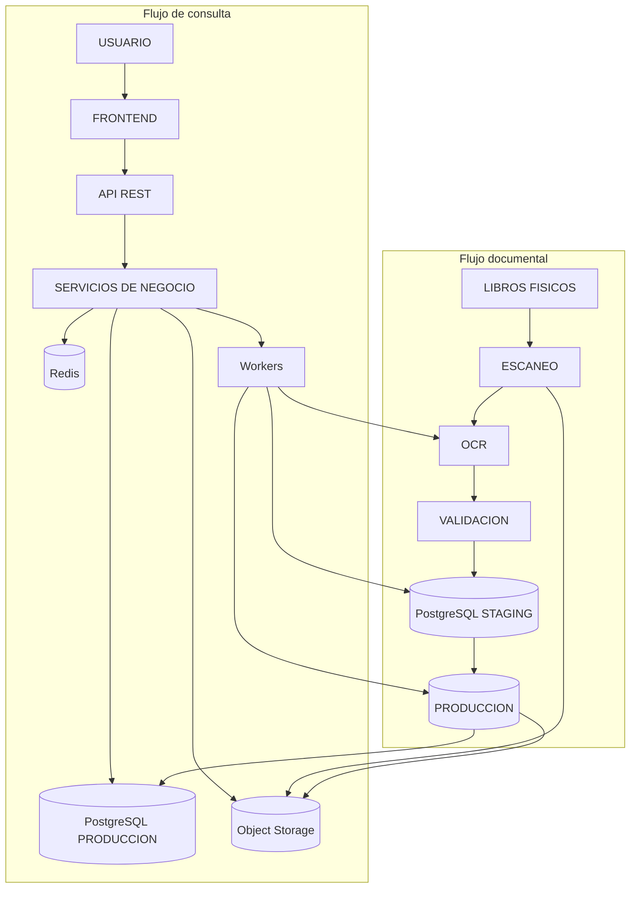

## 30. Conclusiones arquitectónicas

La arquitectura propuesta es adecuada porque responde al problema real: convertir documentos físicos históricos en información consultable sin perder evidencia ni trazabilidad. PostgreSQL concentra los datos validados, Object Storage conserva documentos originales y Redis cumple funciones auxiliares de rendimiento y control.

La zona STAGING reduce errores al impedir que resultados OCR o Excel ingresen directamente a PRODUCCIÓN. El portal administrativo permite revisión humana, correcciones y aprobación controlada. La auditoría conserva quién hizo cada cambio, cuándo y sobre qué registro.

El monolito modular con FastAPI permite una primera versión mantenible, desplegable con Docker Compose y preparada para escalar por componentes. Los workers separan los procesos pesados de las consultas interactivas. La seguridad se apoya en HTTPS, JWT, RBAC, validación de uploads, auditoría y mínimo privilegio.

El elemento más importante de la arquitectura es la trazabilidad documental: cada registro consultado debe poder explicar su origen mediante trabajador, registro histórico, libro, página, documento digital, archivo original e importación.

## RESUMEN EJECUTIVO DE LA ARQUITECTURA

El sistema inicia con libros físicos que son escaneados y convertidos en archivos PDF, TIFF o JPG. Estos archivos se guardan en Object Storage, junto con metadatos como tipo de documento, ubicación, checksum y relación con libro y página. Luego, un motor OCR procesa los archivos para reconocer texto, tablas y campos relevantes. El resultado del OCR puede generarse como Excel, CSV o JSON, pero no se considera información oficial todavía.

Los archivos generados pasan al portal administrativo, donde un operador o administrador los carga al sistema. La API registra la importación, guarda el archivo original, permite previsualizar los datos y ejecuta validaciones de estructura, campos obligatorios, fechas, DNI, años, duplicados y consistencia. Los datos ingresan primero a PostgreSQL STAGING, donde quedan separados los registros válidos, observados, duplicados o erróneos. Los errores y advertencias se muestran al administrador para corrección o exclusión formal.

Cuando una importación cumple las reglas requeridas, el proceso ETL limpia y normaliza los datos, conserva el origen documental y promueve los registros aprobados hacia PostgreSQL PRODUCCIÓN. Esta base de datos es la fuente principal de verdad del sistema. Los archivos grandes permanecen en Object Storage; PostgreSQL guarda referencias, checksums y metadatos, no documentos pesados.

Los trabajadores o usuarios autorizados ingresan al portal de consulta. El frontend consume una API REST segura sobre HTTPS. La API valida el token JWT, aplica roles y permisos, consulta Redis si existe una respuesta cacheada y, si no existe, consulta PostgreSQL con índices optimizados. El usuario puede buscar por DNI, nombres, apellidos, año, periodo, libro o página, y revisar el historial laboral permitido.

Cada registro consultado conserva su trazabilidad: trabajador, registro histórico, periodo, libro, página, documento digital, archivo original e importación. Si el usuario tiene permisos documentales, el sistema puede entregar una URL temporal o visualización controlada del documento asociado. Las acciones críticas, correcciones, accesos documentales e importaciones quedan registradas en auditoría.

La arquitectura recomendada para la primera versión es un monolito modular con Python y FastAPI, PostgreSQL, Redis, Object Storage compatible con S3, workers asíncronos y Nginx como reverse proxy. Esta solución evita complejidad innecesaria, mantiene buena separación lógica, permite crecimiento futuro y protege la información personal mediante autenticación, autorización, auditoría, backups, validación de cargas y cifrado en tránsito.
